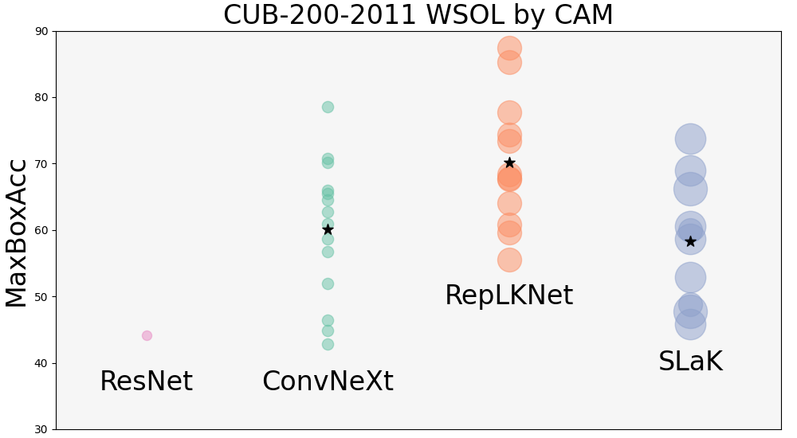

**[CVPR 2024] CAM Back Again**: Large Kernel CNNs from a Weakly Supervised Object Localization Perspective
========

This is the project page for paper:
> [CAM Back Again: Large Kernel CNNs from a Weakly Supervised Object Localization Perspective](), in CVPR2024.



## Abstract

Recently, convolutional neural networks (CNNs) with large size kernels have attracted much attention in the computer vision field, following the success of the Vision Transformers. Large kernel CNNs have been reported to perform well in downstream vision tasks as well as in classification performance. The reason for the high-performance of large kernel CNNs in downstream tasks has been attributed to the large effective receptive field (ERF) produced by large size kernels, but this view has not been fully tested. We therefore revisit the performance of large kernel CNNs in downstream task, focusing on the weakly supervised object localization (WSOL) task. WSOL, a difficult downstream task that is not fully supervised, provides a new angle to explore the capabilities of the large kernel CNNs. Our study compares the modern large kernel CNNs ConvNeXt, RepLKNet, and SLaK to test the validity of the naive expectation that ERF size is important for improving downstream task performance. Our analysis of the factors contributing to high performance provides a different perspective, in which the main factor is feature map improvement. Furthermore, we find that modern CNNs are robust to the CAM problems of local regions of objects being activated, which has long been discussed in WSOL. CAM is the most classic WSOL method, but because of the above-mentioned problems, it is often used as a baseline method for comparison. However, experiments on the CUB-200-2011 dataset show that simply combining a large kernel CNN, CAM, and simple data augmentation methods can achieve performance (90.99% MaxBoxAcc) comparable to the latest WSOL method, which is CNN-based and requires special training or complex post-processing.


## Model Zoo
We provide our models fine-tuned for CUB-200-2011. Based on several findings, our paper also proposes a CNN-based state-of-the-art performance WSOL method using PCA.
| model                      | wsol_method | MaxBoxAcc | MaxBoxAccV2 | download      |
|----------------------------|-------------|-----------|-------------|---------------|
| convnext_base_384_in22ft1k | CAM         | 80.15     | 66.33       | [here](https://drive.google.com/file/d/1JYmMK3EiQQyGTo2CsU6m33juyaAmx2wm/view?usp=drive_link)          |
| convnext_base_384_in22ft1k | PC1         | 83.3      | 76.5        | same as above |
| RepLKNet-31B               | CAM         | 90.99     | 76.4        | [here](https://drive.google.com/file/d/1P8tInmaFknK2sbx5d1__A3U_Ij6T2SD-/view?usp=drive_link)          |
| RepLKNet-31B               | PC1         | 93.6      | 80.4        | same as above |


## Quick start

You can run an example via colab. You will need to download the weight file from [Model Zoo](#model-zoo) (approx. 300 MB).

[](https://colab.research.google.com/drive/14ckRDKOIctAKePdzeIbaTk4zlGEha_uT?usp=drive_link)


## Usage

Command line for generating heatmaps using sample data. You will need to download the weight file specified in fine_tuned_weight_name from [Model Zoo](#model-zoo) and place it appropriately.
```
python generate_heatmap.py --model_family replknet --fine_tuned_weight_name weights/replknet_31B1K384_CUB.pth --test_dataset sample_data heatmap_output heatmap_output --localization_method pc1
```

<!-- ### Requirements -->


## Citation

If you found our paper or code useful, please cite it as:

```
@inproceedings{
  yasuki2024cambackagain,
  title={CAM Back Again: Large Kernel CNNs from a Weakly Supervised Object Localization Perspective},
  author={Yasuki, Shunsuke and Taki, Masato},
  booktitle={Proceedings of the IEEE/CVF Conference on Computer Vision and Pattern Recognition (CVPR)},
  year={2024},
  url={}
}
```
